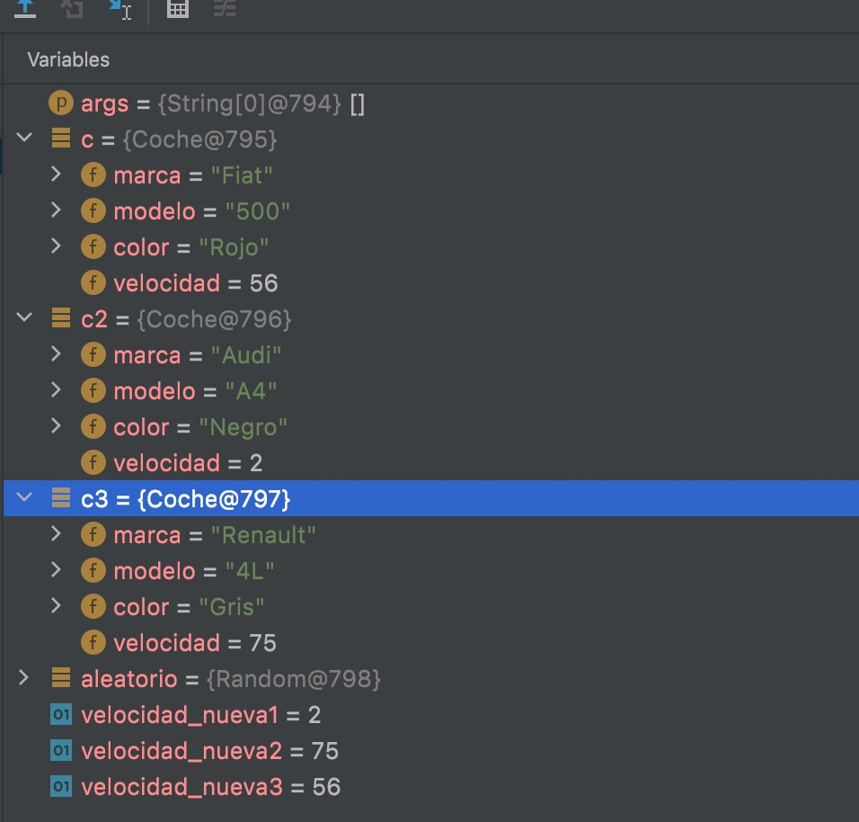
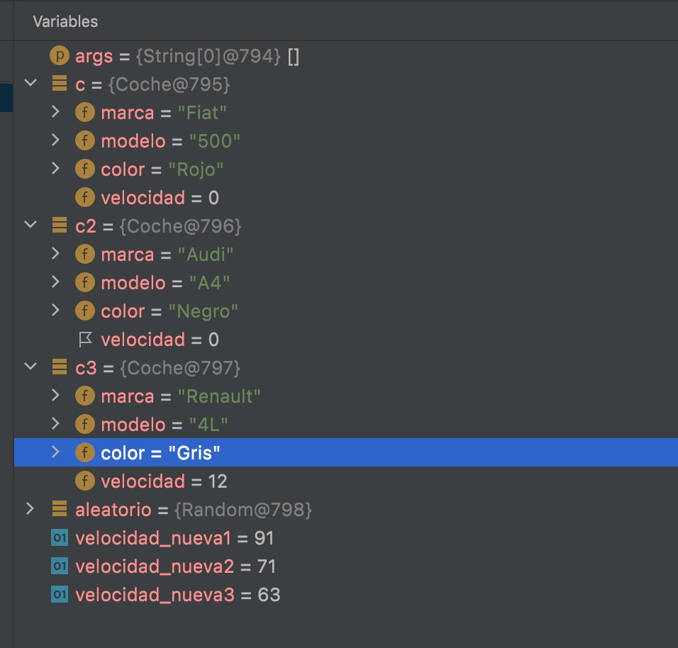

## Depuración 2

### Qué hace el método MAIN

    El método main() es el método de entrada de una aplicación Java, cuando el método a ejecutar es el método main(). La declaración de este método es : public static void main (String []args).Y esta definición está relacionada con el funcionamiento de la JVM.

### Lectura Punto Rotura 27

- Coche c {Fiat,500,rojo,velocidad 56}
- Coche c2 {Audi,A4,negro,velocidad 2}
- Coche c3 {Renault,4L,gris,velocidad 75}

- Velocidad nueva1=2
- Velocidad nueva2=75
- Velocidad nueva3=56
  

### Lectura Punto Rotura 46

- Coche c {Fiat,500,rojo,velocidad 0}
- Coche c2 {Audi,A4,negro,velocidad 0}
- Coche c3 {Renault,4L,gris,velocidad 12}

- Velocidad nueva1=91
- Velocidad nueva2=71
- Velocidad nueva3=63
  
